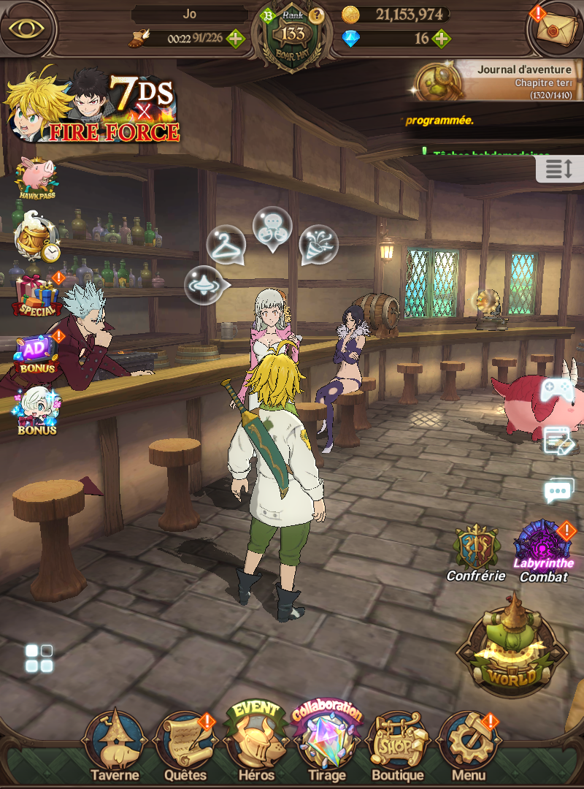

# 7DSGC_Semi-LegitBot

Automation bot for **The Seven Deadly Sins: Grand Cross** (7DSGC).

---

## Prerequisites

- Python 3
- ADB (Android Debug Bridge) included in `platform-tools/`
- Emulator (Only try with MuMuPlayer with the model Galaxy A54)

**Emulator setup:** the game window must be **1080×800** resolution with **200 DPI**.

---

## Installation

1. **Install dependencies:**

   ```bash
   pip install -r requirements.txt
   ```

2. **Get your emulator device ID:**  
   Start your emulator, then run:

   ```bash
   python check_id.py
   ```

   This lists all connected devices (e.g. `emulator-5554`). Copy the ID of your emulator and set it in `config.json` under `"device_id"`.

---

## Where to stand before starting a mode?

**You must be at the tavern** before launching any mode.

Tavern style (season 1, 3, or 4KOA) does not matter, the bot works with any of them.



Stand as shown in the image above, then start the chosen mode.

### Special case for Legendary Boss (mode 4)

For **Legendary Boss farming**, you must **already be in the team selection menu** of the Legendary Boss stage before starting the bot.


Stand as shown in the image above (team selection screen), then launch **mode 4 – Legendary Boss**.

---

## The 4 modes

| Mode | Description |
|------|-------------|
| **1. Daily** | Full daily routine: Taking Beer, Crafting Food, Daily Demons, Special Dungeon, Yggdrasil, Expeditions, Daily PvP and Send Friend Points. |
| **2. Auto Demon Farm** | Farm 1★ demons in a loop (with or without tickets). |
| **3. Equipement Farm** | Automated equipment farming. |
| **4. Legendary Boss** | Automatically farms the Legendary Boss a chosen number of times. |

---

## How to run

```bash
python main.py
```

Then select the mode (1, 2, 3, or 4) from the menu.

---

## Configuration

Settings (e.g. daily demons with/without tickets, `device_id`) are in `config.json`.
