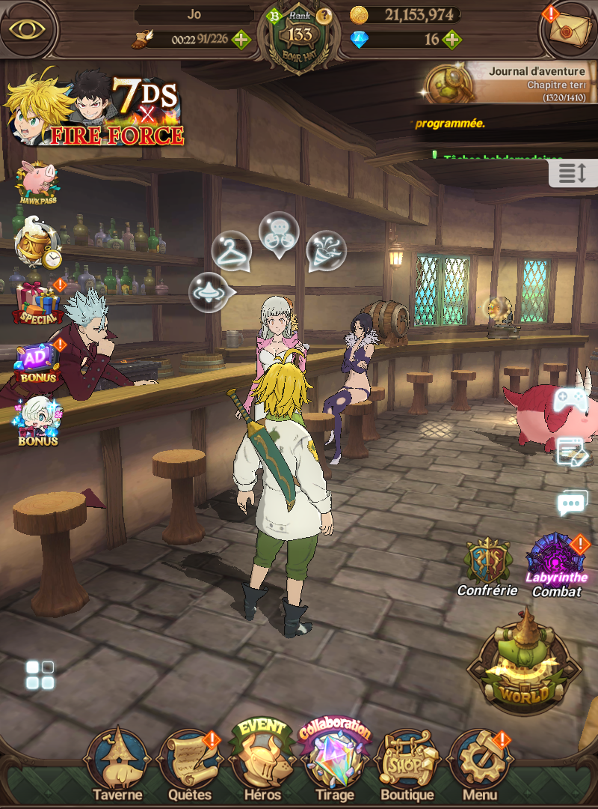
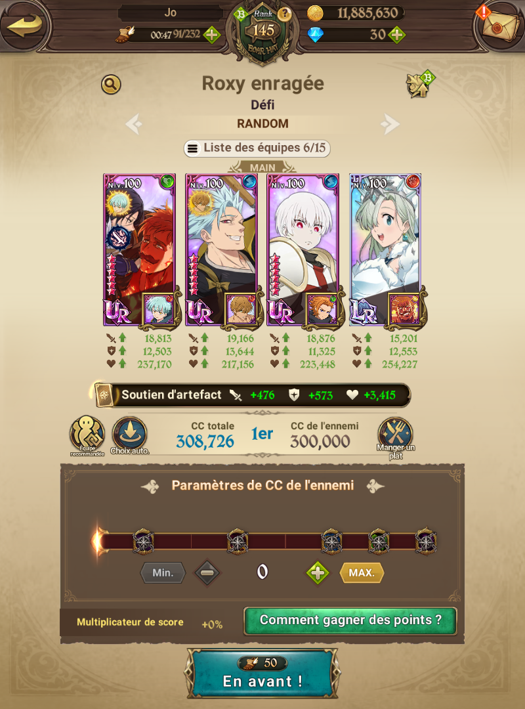
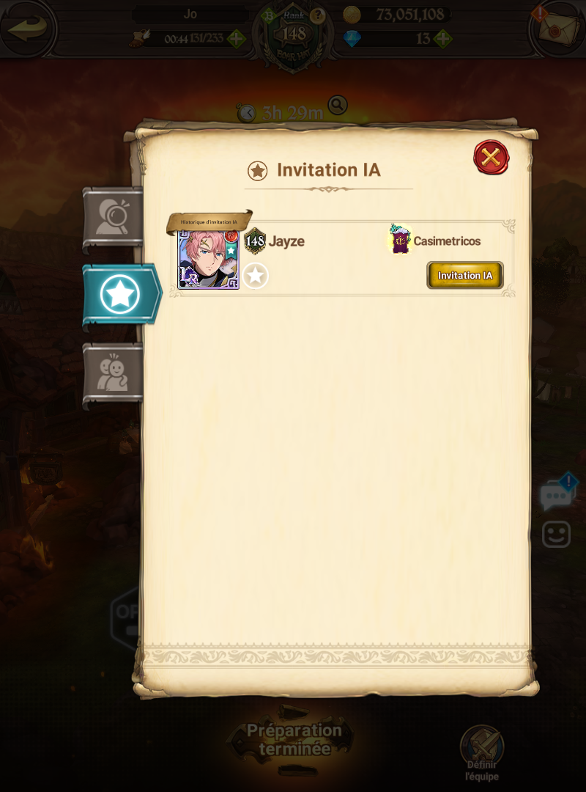

# 7DSGC Semi-LegitBot

Automation bot for **The Seven Deadly Sins: Grand Cross**: **Full Daily**
routine, **Demon Farming**, **Equipment Farming** and **Legendary Boss** runs,
driving an **Android emulator over ADB**.

> **Automating the game breaks Netmarble's terms of service.** Accounts caught
> doing it can be suspended or banned. Use it on an account you are ready to
> lose, at your own risk.

## TL;DR

1. Install **Python 3.10+** (tick _"Add python.exe to PATH"_).
2. Start your **Android emulator** and open the game.
3. `pip install -e .` (first time only).
4. Stand in the **tavern**, run `python main.py`, answer the setup questions on
   the first run, pick a mode. Done.

The emulator is detected on its own and `config.json` is generated by a wizard,
so there is nothing to write by hand.

## Features

- Full Daily routine in one click: recycling, beer, cooking, daily demons,
  special dungeon, Yggdrasil, expeditions, PvP (3v3 + 1v1) and friend points
- Skip the chores you already did today: the daily asks, then runs the rest
- Automatic demon farming, with or without auto-clear tickets
- Per-demon difficulty (easy / hard / extreme / hell)
- Equipment farming by piece or by full set, for a chosen stat
- Automatic equipment recycling: the bot sets the in-game filter itself and
  recycles everything up to SR
- Legendary Boss farming for a chosen number of runs
- Automatic ACT refills, stopping cleanly when the potions run out
- Automatic emulator detection, remembered between runs
- Configuration wizard: writes `config.json` on a fresh install, and asks only
  for the keys that are missing or invalid afterwards

## Prerequisites

- **Windows**: `platform-tools/` ships the Windows ADB build and the bot calls
  `platform-tools/adb.exe` directly
- **Python 3.10+**
- An **Android emulator** (only tested on MuMuPlayer with the Galaxy A54 model)
- **ADB**: already bundled in `platform-tools/`, nothing to install

### Emulator Settings

| Setting        | Value      |
| -------------- | ---------- |
| **Emulator**   | MuMuPlayer |
| **Model**      | Galaxy A54 |
| **Resolution** | 1080 x 800 |
| **DPI**        | 200        |

> These are not a suggestion: every coordinate and reference image in the
> project is captured on MuMuPlayer emulating a Galaxy A54, at this resolution.
> Any other value and the bot mis-taps.

Another emulator or another device model may work just as well, they simply have
never been tried. If one gives you trouble, open an issue with your setup.

### Python Dependencies

Install everything from `pyproject.toml` (recommended):

```bash
pip install -e .
```

Or install the packages by hand:

```bash
pip install "pillow>=10" "opencv-python>=4.8" "numpy>=1.24"
```

## Before Starting

**You must be standing in the tavern** before launching a mode. The tavern style
(season 1, season 3 or 4KOA) does not matter, set `salon_design` to match and
the bot handles all three.



> **Legendary Boss** is the exception: for mode `[3]` you must already be in the
> stage's **team selection** screen, not in the tavern.



### Clear each content once yourself

The bot replays content, it does not unlock it. Every stage a mode enters must
have been **cleared once manually**, so the game reopens it on the level the bot
expects.

The **special dungeon** is the one to watch: the daily starts on its **last
level**, which stays locked until you have finished it once. The same goes for
Yggdrasil, the demon villages and the equipment quests.

### Demons: set a favourite friend

Before running **Daily** or **Auto Demon Farm**, put a friend with a
**well-equipped team** in your favourites. When the bot opens the AI ally list it
takes the **first entry**, whatever it is: your favourite if you have one, or
whoever the game happens to list first if you do not.

So a strong favourite is picked every fight and the demons go down much faster;
without one you get a random ally, which drags the fights out and can lose them
outright.



## Configuration

You do not have to write `config.json` by hand. It is checked before **every**
start, and the bot asks for whatever it cannot answer:

- **no `config.json`**: a short wizard asks every question and writes the file;
- **a key is absent** (a release added an option): only that one is asked;
- **a key holds a value no feature understands** (a typo, or an option that
  disappeared): the offending value is shown and asked again.

When everything checks out the wizard stays quiet and the menu opens straight
away. Without it the bot would run on silent fallbacks: an unknown
`salon_design` skips the beer, a missing `demon_difficulties` entry fights the
demon on easy.

`config.json` holds your own settings, so it is **not tracked by git**: it never
lands in the repo and a `git pull` can never overwrite it. The tracked
`config.example.json` shows the shape of a complete file, if you would rather
copy it and edit by hand instead of answering the wizard.

> A demon added by a later release is picked up the same way, and defaults to
> the difficulty your other demons already use.

### `config.json`

| Key                  | Description                                                         |
| -------------------- | ------------------------------------------------------------------- |
| `device_id`          | ADB device id, filled in automatically, no need to touch it         |
| `salon_design`       | Tavern style: `"1"` (season 1), `"2"` (season 3), `"3"` (4KOA anime) |
| `demon_difficulties` | Per-demon difficulty, see below                                     |
| `daily_demon_stars`  | Star tier for the daily demons: `"1"`, `"2"` or `"3"`               |
| `daily_demon_ticket` | `"true"` to clear the daily villages with auto-clear tickets        |
| `daily_use_ticket`   | `"true"` to spend tickets on the special dungeon and Yggdrasil      |
| `yggdrasil_level`    | `"blue"`, `"yellow"` or `"red"`                                     |
| `yggdrasil_memory`   | Memory floor to run: `"1"` to `"5"`                                 |
| `expedition_items`   | Expedition bonus to pick, see list below                            |
| `only_reward_3v3`    | `"true"` to claim the 3v3 reward without playing any 3v3 match      |
| `pvp_stuff`          | `"true"` to enter 1v1 PvP with equipment, `"false"` without         |

Booleans are stored as the **strings** `"true"` / `"false"`.

`expedition_items` accepts any of: `"atk"`, `"def"`, `"hp"`, `"crit_chance"`,
`"crit_res"`, `"recovery"`.

`demon_difficulties` maps each demon to the difficulty to fight it at, using
`"easy"`, `"hard"`, `"extreme"` or `"hell"`:

```json
"demon_difficulties": {
  "bellmoth": "hell",
  "grey": "hell",
  "howlex": "hell",
  "indura": "hell",
  "red": "hell",
  "original_demon": "hell"
}
```

## Usage

1. Make sure the game is in the **tavern** (or the team selection screen for
   Legendary Boss)
2. Run the bot:

```bash
python main.py
# or, once installed with pip install -e . :
sdsgc
python -m sdsgc
```

3. Choose a mode:
   - `[1]` Daily: the full routine, in order
   - `[2]` Auto Demon Farm: 1-star demons in a loop, with or without tickets
   - `[3]` Legendary Boss: a chosen number of runs
   - `[4]` Equipment Farm: a chosen stat, by piece or by full set
   - `[0]` Exit

The Daily mode chains: recycling → beer → cooking → daily demons → special
dungeon → Yggdrasil → expeditions → PvP (3v3 + 1v1) → friend points. It first
asks whether some of these are already done today and skips the ones you pick.

> **ADB devices** are resolved automatically before each run: the saved
> `device_id` is used as-is while it still answers, otherwise the bot scans,
> restarts the ADB server once if nothing shows up, and saves whatever it
> settles on. You are only asked to choose when several devices are connected
> with nothing configured yet. If no emulator is found at all, the run stops
> with a message instead of tapping into the void.

## Project Structure

The code lives in `src/sdsgc`, laid out **feature-first** (one package per game
mode) on top of a small shared core. Each file does **one thing**, so a mode
reads as a short list of steps and its `runner.py` just wires them together.

```
src/sdsgc/
├── app.py            # entry point: check the config, then open the menu
├── cli.py            # interactive menu that dispatches to a mode
├── config.py         # read-only view over config.json
├── coords.py         # merges coords/*.json into one lookup (per-feature files)
├── screen.py         # semantic screen actions (tap "home", wait "boss_menu"...)
├── paths.py          # resolve files relative to the project root
├── console.py        # the framed banner every mode prints
├── prompts.py        # input() helpers (number, pick-from-list, yes/no)
│
├── driver/           # the emulator, behind one interface
│   ├── base.py       #   shared image/colour matching
│   └── adb.py        #   Android emulator: device detection + adb commands
│
├── setup/            # configuration wizard
│   ├── defaults.py   #   default values + the options each question offers
│   └── wizard.py     #   ask what is missing or invalid, write config.json
│
├── battle/           # battle preparation, shared by demons and dungeons
│   ├── preparation.py#   standard: auto-potions + repeat count
│   ├── ticket.py     #   spend auto-clear tickets instead of fighting
│   ├── auto.py       #   reuse the previous run's settings
│   └── pve.py        #   wait out a fight and dismiss its results
│
└── features/         # one package per mode, one file per action
    ├── daily/          runner (chains the eight chores)
    ├── demons/         boss_menu · fight · clear · cycle · villages ·
    │                   villages_ticket · stars · runner
    ├── equipment/      farm · recycle · runner
    ├── dungeons/       special · yggdrasil
    ├── pvp/            daily_3v3 · daily_1v1
    ├── tavern/         beer · food · expeditions · friend_points
    └── legendary_boss/ fight · runner
```

Coordinates live outside the code, in `coords/*.json` (one file per feature,
plus `common.json` and one per screen several modes share), so a UI change is a
JSON edit rather than a hunt through Python files.

Adding a mode is a matter of dropping a new `features/<mode>/` folder (action
files + a `runner.py`), adding `coords/<mode>.json`, and wiring it into
`features/registry.py`.
